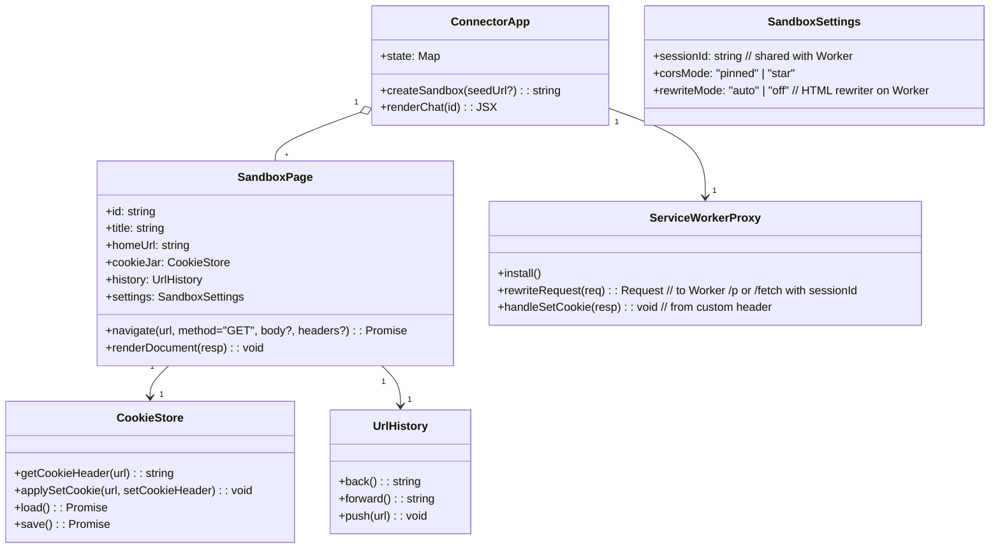
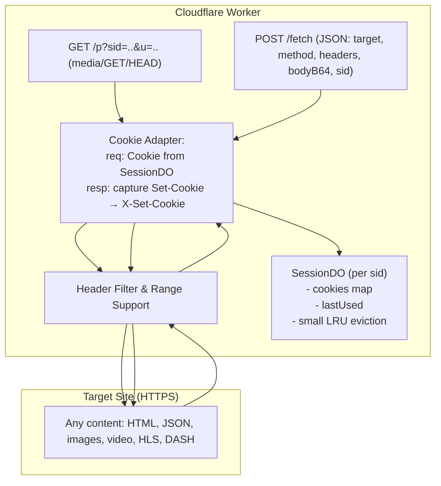
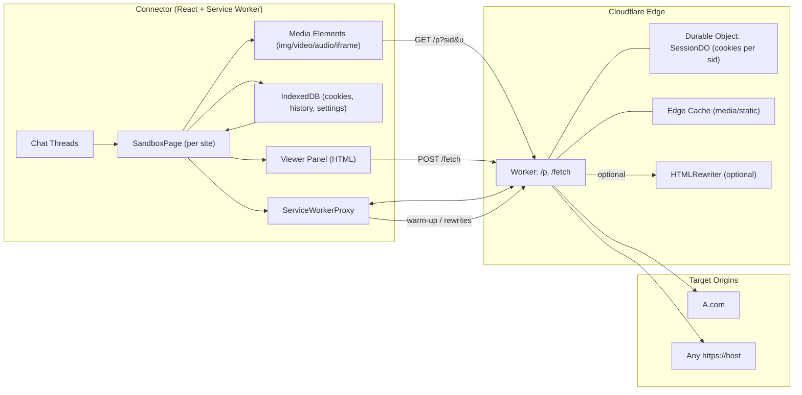

Connector 





```mermaid
sequenceDiagram
  autonumber
  participant UI as SandboxPage (UI)
  participant SW as Service Worker (Connector)
  participant W as Worker (/p or /fetch)
  participant DO as SessionDO (cookies by sid)
  participant A as A.com (HTTPS)

  Note over UI,SW: sessionId = per-sandbox GUID

  rect rgb(245,245,255)
  UI->>SW: media elements GET /p (img/video w/ Range)
    SW->>W: GET /p?sid=SID&u=...
    W->>DO: get cookies(SID)
    W->>A: GET https://A.com/.. (Cookie: ... ; Range if provided)
    A-->>W: 200/206 Stream + Set-Cookie?
    W->>DO: merge Set-Cookie into jar
    W-->>SW: 200/206 Stream (+ X-Set-Cookie for SW)
    SW-->>UI: stream to element
  end

  rect rgb(245,255,245)
    UI->>SW: navigate(url) → POST /fetch {sid,target,method,headers,bodyB64}
    SW->>W: POST /fetch ...
    W->>DO: cookies(SID)
    W->>A: fetch(target,...)
    A-->>W: status+headers+body (stream)
    W->>DO: merge Set-Cookie
    W-->>SW: stream + X-Set-Cookie
    SW-->>UI: deliver; UI updates cookieJar/history
  end
```

Design


> **Important:** This project is split into **two independent repositories**. Do **not** colocate their code. Each repo can be built, tested, and deployed on its own. Integration happens strictly via the **public HTTP contract** defined below.

---

# IMPORTANT (USER)
You are at the worker repo, read above the design file, and work on worker only, here include connector is only for you to take reference. It is a browser in browser application, with cloudflare be the middle person.

Below, everything is AI generated, take consideration.

---

## Repo A — Connector (GitHub Pages)

**Repository:** `connector-router-ui` (static site: React + TypeScript + Vite)
**Deploy target:** GitHub Pages (branch `gh-pages`)
**Purpose:** Chat‑style UI that treats each chat thread as a **SandboxPage** (its own cookie jar/history). All network requests are proxied to the Worker using two endpoints: `GET /p` and `POST /fetch`.

### A.1 Deliverables

* Chat‑style interface with a sidebar of sandboxes (tabs) and a main viewer pane.
* **OOP model:** `SandboxPage` (per‑site sandbox), `CookieStore` (IndexedDB), `UrlHistory`.
* **Service Worker** (`proxy-sw.ts`): warms TLS/H2 to Worker, forwards responses, reads `X-Set-Cookie` and posts updates to the page.
* Media elements (``, `<video>`, `<audio>`, `<iframe>`) use the Worker’s `/p` endpoint with `sid`.
* Programmatic navigation/API calls use the Worker’s `/fetch`.

### A.2 Public Config

* `VITE_WORKER_BASE`: e.g. `https://<worker-subdomain>.workers.dev`
* `CONNECTOR_ORIGIN`: the site origin (used by Worker CORS; mirrored in docs only)

### A.3 Stable Client → Worker Contract

* **GET** `${VITE_WORKER_BASE}/p?sid=<sid>&u=<base64url(absolute_https_url)>`
  Usage: images/video/audio/iframe and simple GET/HEAD. Browser may send `Range`.

* **POST** `${VITE_WORKER_BASE}/fetch` with JSON body:

  ```json
  {
    "sid": "sandbox-uuid",
    "target": "https://host/path",
    "method": "GET|POST|HEAD",
    "headers": { "Accept": "..." },
    "bodyB64": "..." // optional
  }
  ```

**Response headers exposed by Worker** (read-only on the Connector):
`Content-Type, Content-Length, Accept-Ranges, Content-Range, ETag, Last-Modified, X-Set-Cookie`.

### A.4 Key Classes (skeleton requirements)

* `SandboxPage.ts`

  * Props: `id (sid)`, `homeUrl`, `title`, `history`, `cookieStore`.
  * Methods: `navigate(url, init?)`, `renderDocument(resp)`.
* `CookieStore.ts`

  * Methods: `applyFromHeader(xSetCookie)`, `getDisplay(host)`, `load()`, `save()`.
* `UrlHistory.ts`

  * Methods: `push(url)`, `back()`, `forward()`.
* `ConnectorApp.tsx`

  * Create/delete sandboxes; per‑sandbox URL bar + output pane.
* `sw/proxy-sw.ts`

  * Install/activate; `postMessage('warmup')` support; capture `X-Set-Cookie` and forward to clients.

### A.5 Commands

```bash
# dev
npm i
npm run dev
# build for GH Pages
npm run build
# deploy via Actions to gh-pages (include sample workflow in repo)
```

### A.6 Acceptance (Connector‑only, stub Worker)

* Hitting `/p` for a public image returns and renders.
* `<video>` seeks via `Range` (206) through `/p`.
* Posting to `/fetch` returns HTML/JSON rendered in the viewer.

---

## Repo B — Worker (Cloudflare Workers)

**Repository:** `router-worker-edge` (TypeScript + Hono)
**Deploy target:** Cloudflare Workers (`*.workers.dev`)
**Purpose:** Low‑latency HTTPS proxy with minimal validation, streaming, range support, and optional **Durable Object (SessionDO)** for per‑sandbox cookies.

### B.1 Deliverables

* Route: **`GET /p`** for media/GET/HEAD with `Range` passthrough.
* Route: **`POST /fetch`** for JSON control plane (HTML/API/POST bodies).
* Header filtering both ways (strip hop‑by‑hop; expose safe headers).
* CORS: `Access-Control-Allow-Origin` pinned to connector origin (or `*` if no credentials).
* **Optional:** `SessionDO` cookie jar keyed by `sid`, emitting `X-Set-Cookie`.

### B.2 Environment / Config

* `CONNECTOR_ORIGIN` (exact origin string to allow via CORS; or `*`).
* **Optional DO binding:** `SESSION_DO` → class `SessionDO`.

### B.3 Request Handling Rules

* Validate **absolute `https://`** target URLs only.
* Allow **methods**: `GET|HEAD|POST`.
* For `/p`: accept `sid`, `u` (base64url target), copy `Range` header as‑is.
* For `/fetch`: parse JSON, copy allowed request headers and optional `bodyB64`.
* Upstream fetch with `redirect: 'follow'`; set `cf` caching hints (toggle).
* Response: stream body; forward **safe** headers:
  `Content-Type, Content-Length, Accept-Ranges, Content-Range, ETag, Last-Modified`.
* **Cookies:** Never forward raw `Set-Cookie` to the browser. If DO is enabled, merge into jar and emit consolidated `X-Set-Cookie` (URL‑encoded) for the SW to mirror.

### B.4 Files

* `src/index.ts` — Hono app with `/p`, `/fetch`, shared helpers (validation, header filters, base64url utils).
* `src/session_do.ts` — (optional) per‑sid cookie map with `getCookieHeader(url)` & `mergeSetCookies(url, setCookieHeaders[])`.
* `wrangler.toml` — name, bindings, `CONNECTOR_ORIGIN`, DO binding (optional), `compatibility_date`.

### B.5 Commands

```bash
npm i
npx wrangler dev
npx wrangler deploy
```

### B.6 Acceptance (Worker‑only)

* `curl` image via `/p?u=...` returns bytes with correct `Content-Type`.
* `curl` with `Range` returns `206` and proper `Content-Range`.
* `/fetch` relays HTML/JSON with status passthrough.
* If DO enabled: repeated requests show cookies persisted per `sid`.

---

## Integration: Contract Recap (Read‑only in both repos)

* **Endpoints:**

  * `GET /p?sid=<sid>&u=<base64url(absolute_https_url)>`
  * `POST /fetch` with body `{ sid, target, method, headers, bodyB64? }`
* **Worker Response Policy:**

  * CORS: allow Connector origin (or `*`).
  * Expose headers: `Content-Type, Content-Length, Accept-Ranges, Content-Range, ETag, Last-Modified, X-Set-Cookie`.
  * No raw `Set-Cookie` to client; use `X-Set-Cookie` if cookies are supported.
* **Latency:** All bodies streamed; Range passthrough; optional edge cache for media.

---

## Prompts for Codex — Use the Right Repo

### For Repo A (Connector)

> **Generate a React + Vite app** named `connector-router-ui` with:
>
> * Classes: `SandboxPage.ts`, `CookieStore.ts`, `UrlHistory.ts` under `src/app/`.
> * `ConnectorApp.tsx` (chat‑style UI) and `main.tsx`.
> * `sw/proxy-sw.ts` service worker registered from `main.tsx`.
> * An `.env` entry `VITE_WORKER_BASE` used wherever requests are sent.
> * In the viewer, load media by setting `src` to `${VITE_WORKER_BASE}/p?sid=...&u=...` and fetch HTML/API via `${VITE_WORKER_BASE}/fetch`.
> * Provide minimal CSS for a chat‑like layout (sidebar + pane).

### For Repo B (Worker)

> **Generate a Hono Worker** named `router-worker-edge` with routes `/p` and `/fetch`:
>
> * Validate https targets; allow only GET|HEAD|POST; strip hop‑by‑hop headers.
> * `/p` supports `Range`; forward/return `Accept-Ranges` and `Content-Range`.
> * Stream responses; set `Access-Control-Allow-Origin` to `CONNECTOR_ORIGIN` (or `*`).
> * `Access-Control-Expose-Headers` includes `Content-Type, Content-Length, Accept-Ranges, Content-Range, ETag, Last-Modified, X-Set-Cookie`.
> * Optional `SessionDO` for cookies; emit `X-Set-Cookie`.
> * Include `wrangler.toml` with required bindings.

---

## Visual — High‑level Separation

```mermaid
flowchart LR
  subgraph RepoA[Repo A: connector-router-ui (GitHub Pages)]
    A1[React UI: ConnectorApp]
    A2[SandboxPage / CookieStore / UrlHistory]
    A3[Service Worker: proxy-sw]
  end

  subgraph RepoB[Repo B: router-worker-edge (Cloudflare Workers)]
    B1[GET /p — media/GET/HEAD]
    B2[POST /fetch — JSON control]
    B3[(optional) SessionDO — cookies per sid]
  end

  A1 -->|/p, /fetch HTTP| B1
  A1 -->|/p, /fetch HTTP| B2
```

---
